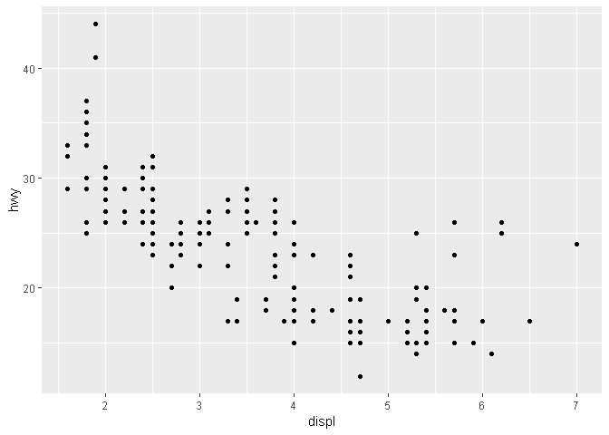

Primeira Lista de Exercícios
================

Para fazer esta lista, crie um notebook no Rstudio. Tente separar os exercícios em *chunks* e documentar os comentários/respostas pertinentes. Os exercícios foram retirados do livro [R for Data Scientists](https://r4ds.had.co.nz/), e este pode e deve ser consultado para auxiliar nas resoluções.

Para os próximos exercícios, iremos utilizar um dataset do pacote ggplot2 chamado `mpg`. Primeiramente, você deverá carregar o `tidyverse` (lembre-se que o `tidyverse` é uma coletânea de pacotes, e um deles é o `ggplot2`):

    library(tidyverse)

Podemos acessar o help do Rstudio para sabermos mais sobre este dataset. Fazemos isso com o comando `?mpg` ou `help(mpg)`. Para facilitar a manipulação e visualização, iremos criar uma variável chamada `df` (abreviação de data frame) para armazenar `mpg`.

``` r
df<-mpg
```

Note que a variável `df` aparece na lista de variáveis no Global Environment. Podemos usar o visualizador do Rstudio para ver `df` como se fosse uma "tabela de Excel" - clique na variável `df` no Global Environmet, ou digite o código `view(df)`. Note também que, como `mpg` vem do tidyverse, df já é um `tibble`, nossa estrutura de dados de preferência. Para checar isso, podemos usar a função `is_tibble()`:

``` r
is_tibble(df)
```

    ## [1] TRUE

O pacote `ggplot2` fornece ferramentas muito poderosas para visualização de dados. Aqui iremos introduzir apenas a sintaxe mais básica para gerar um gráfico; vamos fazer um *scatterplot* (gráfico de dispersão). Primeiro devemos dizer quais dados iremos utilizar, e para isso iremos fazer `ggplot(data=df)`. Rode este código; o que você vê? Para fazer o gráfico entre as variáveis `hwy` e `displ`, temos que **adicionar** o tipo de gráfico e seu mapeamento: `geom_point(mapping = aes(x = displ, y = hwy))`. Aqui, `geom_point` vai nos dar o *scatterplot*.

``` r
ggplot(data=df) +
  geom_point(mapping = aes(x = displ, y = hwy))
```



O ggplot oferece grande versatilidade para exibirmos nossos dados, para maiores informações sobre como fazer os variados tipos de gráficos, acesse [r4ds](https://r4ds.had.co.nz/data-visualisation.html) e [R Graph Gallery](https://www.r-graph-gallery.com/) . Além disso, este [cheatsheet](https://www.rstudio.com/wp-content/uploads/2015/03/ggplot2-cheatsheet.pdf) pode ser útil.

Exercícios
----------

1.  Quantas linhas `df` possui? E colunas? (Faça usando código R)

2.  O que a variável `drv` descreve? (Leia o help em `?mpg`)

3.  Faça um *scatterplot* de`hwy`por `cyl`. Que relação podemos traçar entre estas variáveis? Como podemos explicar essa relação?

4.  O que acontece se você fizer um *scatterplot* entre `class` e `drv`? Porque este gráfico não é útil? Você consegue pensar em uma visualização que seria mais útil para essas variáveis?

5.  Quais variáveis de `df` são categóricas? Quais são contínuas? (lembre-se de ler a documentação em `?mpg`). Como poderíamos descobrir isso a partir de `df`?

6.  Lembre-se que podemos criar um *grid* de gráficos no ggplot adicionando `facet_wrap()`.

    -   Rode:

            ggplot(data = mpg) + 
              geom_point(mapping = aes(x = displ, y = hwy)) + 
              facet_wrap(~ class, nrow = 2)

    -   Agora rode o seguinte código. O que ele faz?

            ggplot(data = mpg) +   
              geom_point(mapping = aes(x = displ, y = hwy)) +   
              facet_wrap(vars(cyl,drv), nrow = 3)  

7.  Adicione um faceteamento no gráfico da questão 4 utilizando a variável `manufacturer`. Escolha o número adequado de linhas (`nrow`) para a visualização. Este faceteamento foi útil? Por quê?
